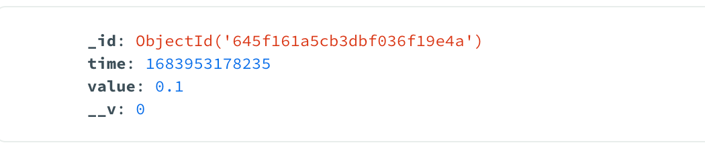
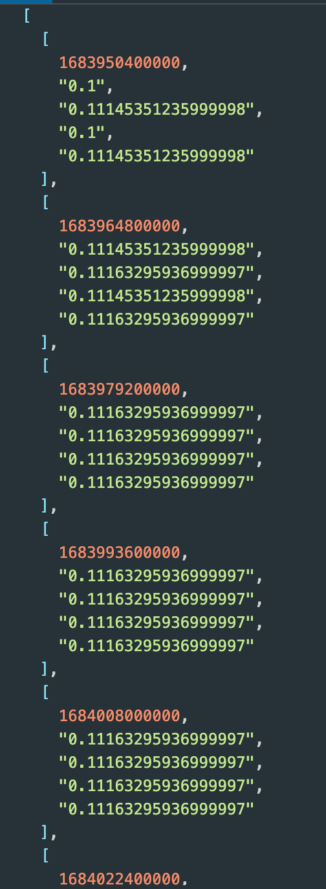

## Binance API response converter

### Description
Convert from coin price data to Binance API response format:

From


To


Supported chart type

- [x] H1
- [x] H4
- [x] D1

### Installation

**Prerequisites:**
- Node.js version 18
- Redis server is running locally with port **6379**

**Steps:**
1. Cloning the source code
2. Run `npm i`
3. Run `npm run dev` to serve the web server locally. The server will listen on port **3000**

### API Request

There is 1 API to retrieve hotel data: `GET /price`. This API accept following parameters
- **chart**: Chart type - *ex: chart=d1*

### API Response

The response format is like below:

```
[
  [
    1683950400000,
    "0.1",
    "0.11145351235999998",
    "0.1",
    "0.11145351235999998"
  ],
  [
    1683964800000,
    "0.11145351235999998",
    "0.11163295936999997",
    "0.11145351235999998",
    "0.11163295936999997"
  ],
  [
    1683979200000,
    "0.11163295936999997",
    "0.11163295936999997",
    "0.11163295936999997",
    "0.11163295936999997"
  ],
  [
    1683993600000,
    "0.11163295936999997",
    "0.11163295936999997",
    "0.11163295936999997",
    "0.11163295936999997"
  ],
]
```
### Optimization 🚀
- For **faster reading**, I utilize **Redis** for caching data, resulting in a reduction of **200 times** in read times (on my local machine).
